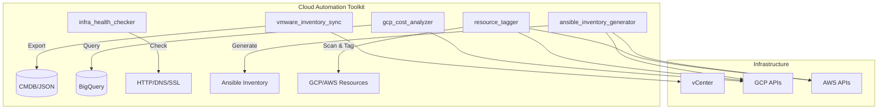
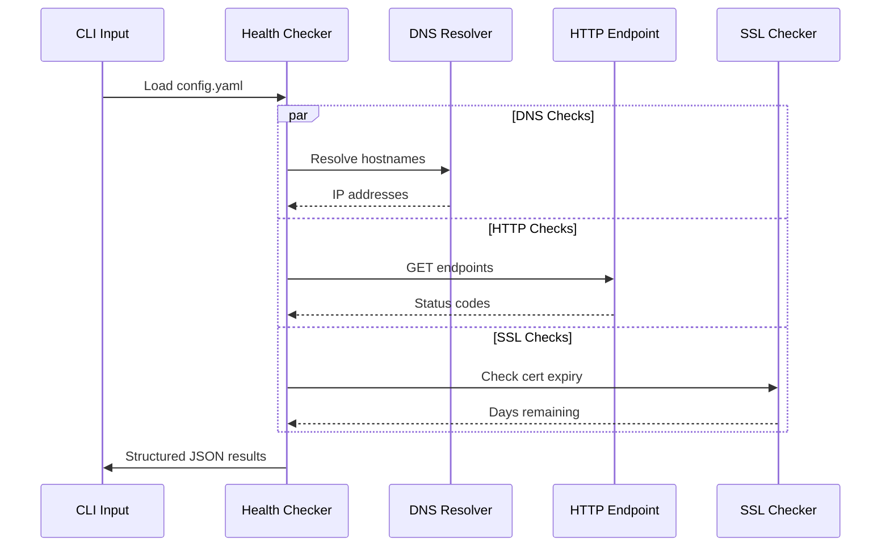

# Cloud Automation Toolkit

Python-based automation tools for cloud infrastructure management, monitoring, and operations. These scripts represent sanitized patterns from production automation frameworks, designed to demonstrate practical cloud engineering and DevOps workflows.

## Tools

| Script | Description |
|--------|-------------|
| `vmware_inventory_sync.py` | Syncs VMware vSphere VM inventory to JSON/CSV for CMDB integration. Collects compute, storage, and network details across clusters. |
| `gcp_cost_analyzer.py` | Analyzes GCP billing exports via BigQuery. Identifies top cost drivers, detects anomalies, and produces actionable spend reports. |
| `infra_health_checker.py` | Multi-target infrastructure health checks: DNS resolution, HTTP endpoint availability, and SSL certificate expiry. Parallel execution with structured output. |
| `ansible_inventory_generator.py` | Generates Ansible-compatible dynamic inventory from cloud provider APIs (GCP, AWS). Groups hosts by tags, region, and environment. |
| `resource_tagger.py` | Scans cloud resources for tag/label compliance against policy. Reports violations and optionally auto-applies missing tags. |

### Toolkit Architecture



## Requirements

- Python 3.10+
- Dependencies listed in `requirements.txt`

Install:

```bash
pip install -r requirements.txt
```

## Configuration

Copy the example config and populate with your values:

```bash
cp config_example.yaml config.yaml
```

All sensitive values (credentials, project IDs, endpoints) are read from environment variables or config files that are excluded from version control via `.gitignore`.

## Usage Examples

```bash
# VMware inventory export
python vmware_inventory_sync.py --output inventory.json --format json

# GCP cost analysis for the past 30 days
python gcp_cost_analyzer.py --project my-gcp-project --days 30

# Infrastructure health checks from a YAML config
python infra_health_checker.py --config config.yaml --output results.json

# Generate Ansible inventory from GCP
python ansible_inventory_generator.py --provider gcp --project my-gcp-project

# Tag compliance scan with auto-remediation
python resource_tagger.py --provider aws --region us-east-1 --auto-apply
```

### Health Check Flow



## Development

```bash
# Lint
make lint

# Format
make format

# Run tests
make test
```

## Note

These are sanitized patterns from production automation frameworks. All credentials, endpoints, and project identifiers have been replaced with placeholders. The code demonstrates architectural patterns, not deployment-ready configurations.

## License

MIT
